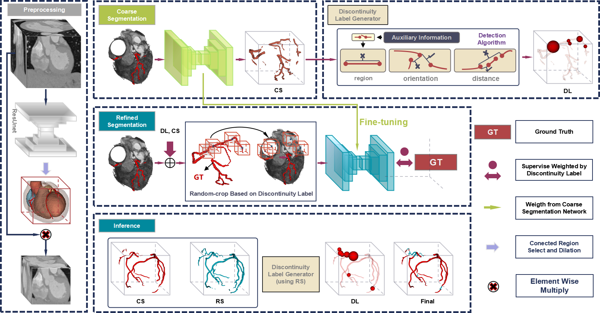

# SparrowLink: a two-Stage, two-Phase And special-Region-aware segmentation Optimization Workflow for discontinuity-Link

# One-phase version: DISCONTINUITY-AWARE CORONARY ARTERY SEGMENTATION ON CCTA IMAGE
 

## Training & Inference
Our pipeline includes CS(Coarse Segmentation), IP(Information Processing), RS(Refined Segmentation), IF(Final Inference), and CM(Calculate Metric) modules. Each module can be run independently, allowing for flexibility in the training and inference process.

You can simply run the following command to run the whole pipeline:
```bash
sh pipeline/SparrowLinkv4.sh -c 11111 -t 1 -s 1
```

If your data only have one phase, you can run the following command:
```bash
sh pipeline/SparrowLinkv3_nnUnet_ASOCA.sh -c 11111 -t 1 -s 0
```
You need to modify the `experiments_path`, `data_path` and `configs_path` in the `pipeline/SparrowLinkv4.sh` or `pipeline/SparrowLinkv3_nnUnet_ASOCA.sh` file to your own path.
If nnUnet backbone is selected, you need to also modify `raw`, `preprocessed`, `results` in `pipeline/SparrowLinkv4.sh` or `pipeline/SparrowLinkv3_nnUnet_ASOCA.sh` file to your own path.

You can flexibly choose the backbone network, augmentation strategy, and training strategy, inference strategy by modifying the config file in `configs/` directory.
Right now, there are two example config for one phase pipeline: `configs/two_stage2/first_stage/ResUnet_dice_with_random.yaml` and `configs/two_stage2/second_stage/ResUnet_dice_with_random.yaml`. You can modify the config file to your own needs.
## Data
Your data should be organized in the following structure:
```
data_path/
├── train
│   ├── name1.nii.gz
│   ├── name2.nii.gz
│   └── ...
├── test
│   ├── name1.nii.gz
│   ├── name2.nii.gz
│   └── ...
```
You should add the `train` and `test` folders to the config file. 

## Citation

If you find this work helpful, please consider giving this repository a star ⭐ and citing our paper:
```
@INPROCEEDINGS{ISBI,
  author={Xiong, Xiaosong and Zhang, Xiao and Jiang, Caiwen and Liu, Jiameng and Cui, Zhiming and Wu, Dijia and Shen, Dinggang},
  author+an = {1=highlight},
  booktitle={2024 IEEE International Symposium on Biomedical Imaging (ISBI)}, 
  title={Discontinuity-Aware Coronary Artery Segmentation on CCTA Image}, 
  year={2024},
  volume={},
  number={},
  pages={1-5},
  keywords={Image segmentation;Solid modeling;Codes;Computed tomography;Angiography;Merging;Detectors;Coronary Artery Segmentation;Discontinuity Link Algorithm;Topology Preserving},
  doi={10.1109/ISBI56570.2024.10635820}}
```

## Acknowledgment
This project is partially built upon the [**MONAI**](https://github.com/Project-MONAI/MONAI) framework.
